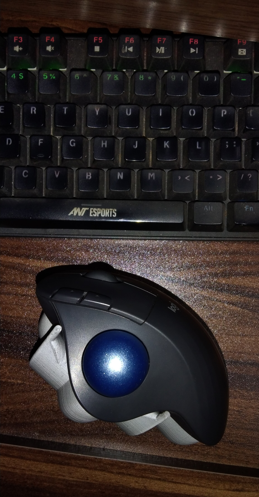
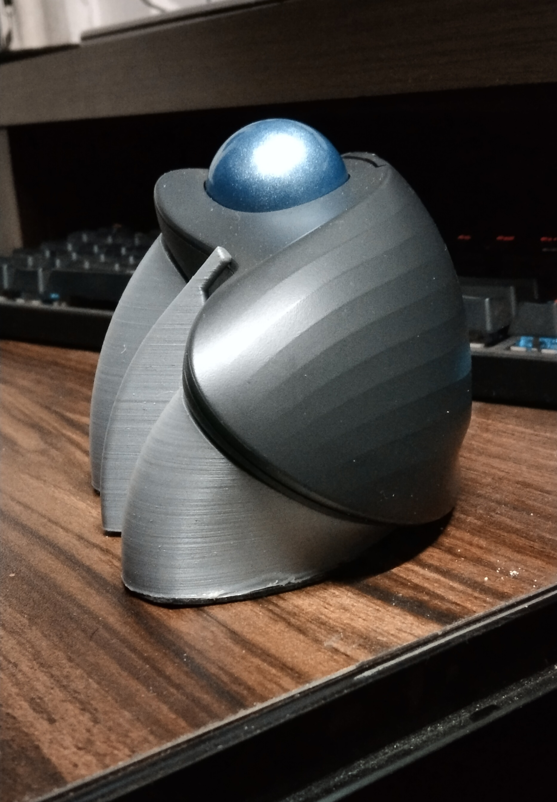
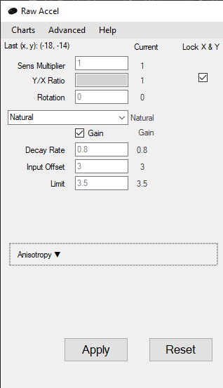

## How?
The day I started working out my arms were fucked for some days and I thought it was ergonomics.

## Why trackball?
In the thrill of trying something new, on the `10th of January 2023` my lizard brain bought a `Logitech Ergo M575` because trackballs are better than mice for health.

## How is it different from a traditional mouse?
This is a thumb trackball mouse. The other variant of trackball mice are finger trackballs.

Finger trackballs look better for precision relative to thumb trackballs but thats just from watching people playing with it on youtube.

## How have I been using it?
I use my trackball for both gaming and work.
When I am gaming, the trackball stays on the usual position ie right side of the keyboard.
When I am working, it stays below the keyboard because its better for me to move from home row toward myself.

I have a 45 degree tent for the trackball so my palm is at around 90 degrees from the tray.

### Have I been using acceleration?
Yes, I use Jump acceleration. No I do not know the difference between the types of acceleration but Jump feels the best for me. I use rawaccel for acceleration settings. I haven't setup acceleration on linux yet.
Most of the trackballers in the community use acceleration as well.

### Whats the curve?

## What is my conclusion for now?
For work, its the best for me as a programmer. Its good for productivity and certain types of games where you don't need reflexes. I had alot of fun on this playing Civilization.

## What am I looking upto next?
I am going to play games on this thing for a while and record my observations.
I am also going to buy a finger trackball soon so I can play better.

## Do I have a youtube channel where I play with the trackball?
[Jarusll](https://www.youtube.com/@jarusll)
